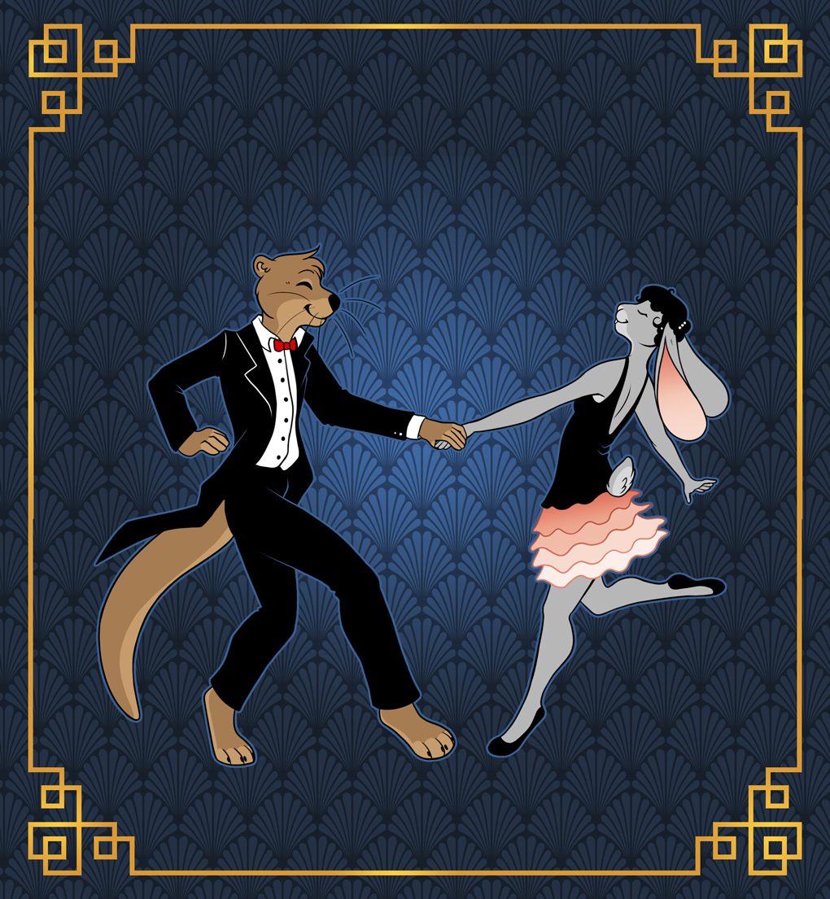

Dance Competition
-----------------

Dance competition application deadline: May 11, 2017 11:59:59 PM

<a href="https://docs.google.com/forms/d/1sJrbgK6BO2r7Se2WN0d-IfrTU9-V2SQRk4gh8IRbjL0/viewform" target="_blank" rel="noopener noreferrer" class="btn-register">Enter the Dance Competition</a>

If you would like to judge, send an email to [dancecomp@furlandia.org](mailto:dancecomp@furlandia.org).

### Rules

The Furlandia Fursuit Dance Competition will have two categories:

* **Full Suit:** Contestant's fursuit must cover the entire body, with no skin
  showing.
* **Partial Suit:** Contestant's fursuit must cover the head, hands, and feet.
  The remaining parts of the body must be covered with or articles of clothing.
  Arms and legs may be covered with either clothing or fursuit arms/legs. If the
  fursuit covers the entire body, the contestant will be considered a Full Suit
  contestant.

Each category will have up to ten contestants, for a total maximum of twenty
contestants. Submissions into the Dance Competition can be made
<a href="https://docs.google.com/forms/d/1sJrbgK6BO2r7Se2WN0d-IfrTU9-V2SQRk4gh8IRbjL0/viewform" target="_blank" rel="noopener noreferrer">online</a>
until two weeks before Furlandia. If positions are still available at the start
of Furlandia, contestants may sign up for the remaining positions at
Registration.

The Dance Competition will have two events:

*   **Preliminaries**

    Saturday, May 27, 6:00pm &mdash; 7:00pm    
    Main Theater

    All contestants will compete at this event on Saturday. The top five
    contestants from each category will move on to the Finals, for a total of
    ten finalists.

*   **Finals**

    Sunday, May 28, 3:00pm &mdash; 5:00pm    
    Main Theater

    The top five contestants from each category will compete at this event
    on Sunday. Awards will be given to the top three contestants in each
    category at the end of the event.

### Music

Each contestant will have up to three minutes for their routine.

Music and dance must be PG-13 or appropriate for general audiences. If the music
is determined to be inappropriate upon submission, Furlandia staff will ask you
to submit either a censored version of the music or a different music selection.

Send music to [dancecomp@furlandia.org](mailto:dancecomp@furlandia.org). We can
accept the following file formats:

* AAC
* AIFF
* CAF
* M4A
* MP3 / MP4
* WAV

### Judging

Dances wil be judged based on the following criteria:

* **Choreography:** How well was the performance thought out and planned?
* **Execution:** How well were the moves and choreography executed?
* **Musicality:** How well did the performance reflect the music choice?
* **Character:** How well did the performance reflect the character performing
  the dance?
* **Audience Engagement:** How engaged was the audience with the performance?
