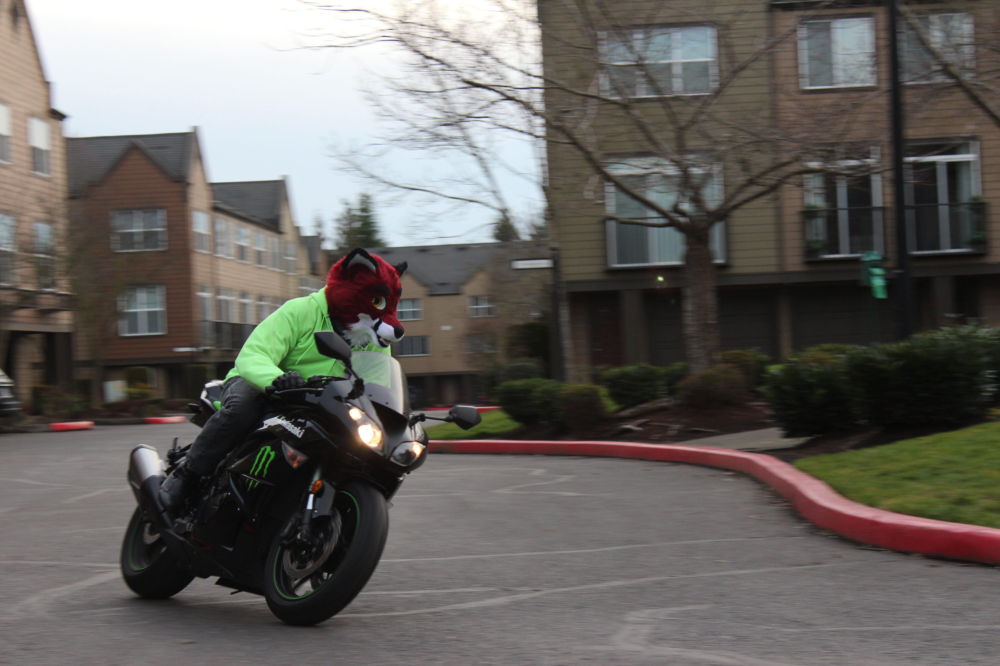

MotoFur Meet
------------

Furlandia 2017 is proud to present our very first

> **MotoFur Meet**    
> Sunday, May 28, 2017    
> 12:00pm &mdash; 1:00pm    
> Sheraton Portland Airport Hotel parking lot

What's a MotoFur meet? The clue is in the name: it takes cars, motorcycles
and trucks (and anything else you happen to drive or ride on a daily basis)
and combines them with like-minded furries, fursuiters (and probably some
good beats too).
This is a great chance for all you MotoFurs to show off your ride, be it a
vintage hot rod, a sweet slammed rice burner or a go-anywhere off-roader.

It doesn't matter if your ride has two, three, four or more wheels. If you're
a MotoFur with a cool vehicle to show, the MotoFur meet is for you! And if
you're someone who doesn't have a vehicle to show but appreciates some good
engineering, don't worry: you'll be welcome too.

Due to space limitations at our host hotel, those who are intending to show
their vehicles at MotoFur must register in advance using the form above, as
well as agree to a few rules governing the event.

*Please note that applying to exhibit your vehicle does not guarantee a space
in the MotoFur Meet. Those who are not granted a space will not be permitted
to exhibit their vehicles in the MotoFur Meet.*

Closing date for MotoFur entries will be 11:59.59PM PDT on Sunday, April 30.
We will reach out to those who are chosen to exhibit their vehicles the
following week.

So get out your polish, get detailing, and we'll see you at Furlandia 2017
MotoFur Meet!
